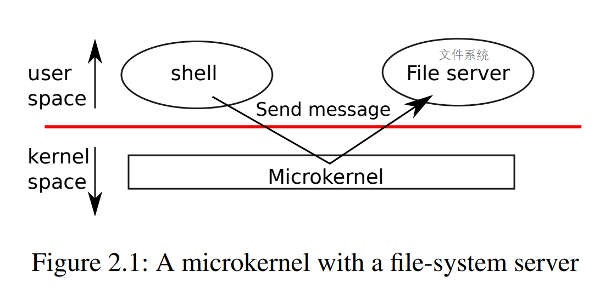

Operating system organization

- 操作系统使用time-share提供多任务的能力
- xv6运行在RISC-V上，使用"L(long)P(pointer)64"C语言实现

2.1 Abstracting physical resource 物理资源抽象

- 为什么不将system-call做成库？因为多个任务同时运行的时候，需要互相协调
- Unix资源抽象
  - 文件描述符fd和I/O调用
  - exec加载程序镜像

2.2 User mode, supervisor mode, and system calls

- RISC-V指令集提供了强隔离支持
  - 机器指令模式：允许执行任意操作，通常用来初始化计算机
  - 特权模式：可以执行特权指令，比如启用/禁用终端，读取某个寄存器
  - 用户模式：只能执行普通指令，比如加减乘除
- user space用户态：只能执行用户模式指令的软件
- kernel (space)内核态：运行特权指令的软件
- 若用户态执行特权指令，则控制权会被移交到内核程序（处于特权模式），有内核程序决定是否终止用户程序
- RISC-V使用ecall进入内核
- 内核入口(可通过ecall进入)点只能由内核程序控制

2.3 Kernel organization

- monolithic kernel：宏内核，所有系统程序/指令全部运行在特权模式
  - 优点：系统内部可以共享数据，无需区分每个部分的模式
  - 问题：复杂模块容易出bug
- microkernel：微内核，最小化特权模式的指令数目，其他指令在用户模式运行
  - 需要一些底层函数支持：启动应用、发送消息、访问硬件设备
  - 内核与用户程序通过底层函数通信

2.4 Code: xv6 organization

见book

2.5 Process overview

- 资源隔离单位是进程
- 内核使用三个技术实现进程
  - user/supervisor 模式标志位
  - address spaces 地址空间
  - time-slicing of threads 线程时间片技术
- RISC-V提供了page table页表的硬件支持，xv6使用其分配内存
- 最大内存受限于寻址的位数，xv6使用指针的38位寻址，最大地址是 2^38-1 = 0x3fffffffff
- 进程包含一个`execution of thread`，能够`suspend 挂起`和`resume 恢复`
- 进程状态保存在 `struct proc {userstack, kernekstack, state, pagetable}` 中，包含`user stack` 和 `kernel stack`
  - user stack：用户指令的执行栈
  - kernel stack：进入内核后的执行栈
- 系统调用与RISC-V
  - ecall，修改程序计数器PC到内核入口点，提权执行syscall
  - sret退出内核，降权执行用户指令
- 进程在I/O操作上会block阻塞
- `proc->state`：进程状态，已分配、准备运行、正在运行、等待I/O、已退出
- `proc->pagetable`：进程页表，可以让硬件直接使用其作为页表

2.6 Code: starting xv6 and the first process

1. 开机
2. 运行ROM中的bootloader，将xv6内核载入内存
   1. RISC-V起始时paging硬件是禁用的，虚拟地址直接映射到物理地址
   2. 内核在内存中起始于0x80000000，0x0~0x80000000为I/O设备
   3. 内核从_entry(kernel/entry.S:6)开始执行
3. _entry创建一个栈以执行C代码
   1. 初始化栈空间stack0 (kernel/start.c:11)
   2. 将栈顶stack0+4096放到栈顶指针寄存器sp
   3. 调用start函数开始执行(kernel/start.c:21)
4. start在machine mode下执行一些配置
   1. 禁用supervisor模式下的虚拟地址转换
   2. 代理supervisor模式下的中断和异常
   3. 设置寄存器mstatus为supervisor模式，设置寄存器mpec值为main函数地址
   4. 配置cpu时钟芯片的中断定时器
   5. 调用mret指令开始从main执行(mret会从machine模式'回'到supervisor模式)
5. main初始化设备和子系统，然后
   1. 调用userinit(kernel/proc.c:212)创建**第一个进程**
   2. 第一个进程执行initcode.S(user/initcode.S)，使用exec执行`/init`程序
6. init(user/init.c:15)创建控制台设备并打开0,1,2文件描述符

2.7 Real world

- 宏内核、微内核
  - linux是宏内核
  - L4，Minix，QNX等嵌入式多是微内核
- 多线程支持：需要一些额外的系统功能，如linux的`clone`

4.3 Code: Calling system calls

执行第一个系统调用`exec("/init")`
- 将参数保存在寄存器中
- 使用ecall陷入内核并执行`uservec, usertrap`
- 执行对应的syscall，即SYS_exec
- 将返回值记录到`trapframe->a0`

4.4 Code: System call arguments

系统调用的参数获取
- 陷入内核态时trapframe和寄存器会保存
- `argint, argaddr, argfd`用来获得整数/指针/文件描述符参数
- 内核态没有地址翻译，需要考虑指针安全
- xv6使用`fetchstr, copyinstr, copyoutstr`获得字符串值
- `copyinstr`使用`walkaddr`来获得虚拟地址对应的物理地址
- `walkaddr`会检查参数是否为调用程序可用的合法地址

未了解内核态时的疑问：用户态到内核态切换，或者说执行系统调用为何会有开销overhead？
- 系统调用需要CPU陷入trap into内核态
- 需要进行许多操作
  - 指令模式切换：User mode -> Supervisor mode
  - 保存用户栈，寄存器信息
  - 获得/拷贝系统调用参数，并校验调用入口和参数是否合法
- 最后才会在程序的kernel栈上执行系统调用
