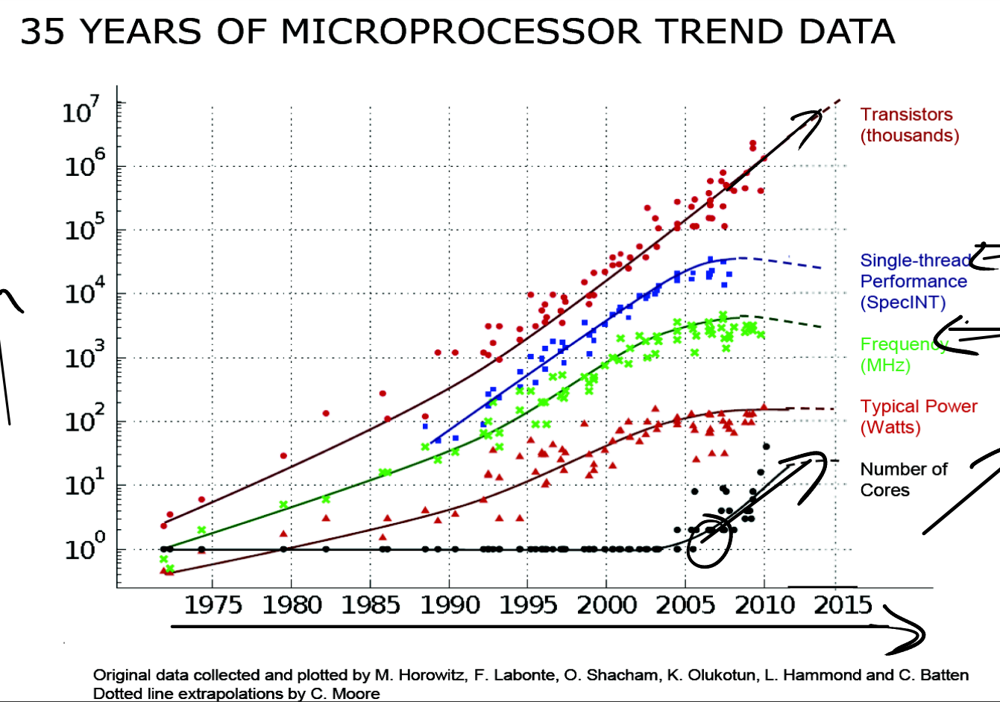

- 为什么会出现多核技术：时钟频率不再增加，单线程的性能因此趋于极限，需要利用多核达到更高性能，下图
  
  

- lock abstraction 锁是一种抽象的概念
  - acquire只允许一个进程获取锁，其它进程需要等待

- 可以自动加锁吗？每个数据结构都加锁 <-> 整个内核加锁；两种极端

- 思考lock的方式
  - 帮助避免 **丢失更新**
  - 是多个操作 **原子化**
  - 帮助维护一个 **不变量/不变状态**

- 模块m1的`g()` 调用 模块m2的`f()`，那m1需要知道m2的`f()`使用了哪些锁
  - 锁打破了模块化的抽象，m1需要知道m2的内部锁信息

- 锁与性能：锁会影响性能，如何设计锁
  1. 从粗粒度的锁开始 coarse grined
  2. 测量粗粒度锁是否出现竞争/冲突 - 重新设计冲突的部分 fine grined

- uart中的锁
  - uart中断处理函数 和 printf等使用uart的函数，可能会在不同的CPU上同时运行，因此需要加锁

- 硬件上的 `test-and-set` 支持，RISC-V的`amoswap`
  - 硬件上的实现方式很多：内存控制器；总线控制器；高速缓存一致性

- 相比amoswap，普通的存储指令`sd`可能不是原子的：可能会先加载到缓存再更新

- 内存屏障memory barrier也叫fence

- 非必要不共享数据：避免race condition

- RISC-V的amoswap指令也包含了memory order，下图
  
  