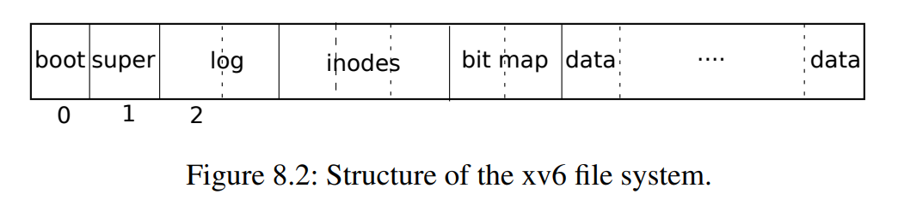

8 File Systems

- 文件系统用来共享数据，需要持久化保存数据
- 文件系统的挑战
  - 磁盘上的数据结构设计：文件/目录的树形结构，记录哪些块可用
  - 崩溃回复crash recovery：断电重启能够保持正常工作
  - 多个处理器并发访问，需要协调以保证正确性invariants
  - 需要对常用数据进行缓存


8.1 Overview

- 七层
  - Disk层 操作硬件
  - Buffer cache层 同步不同进程的操作，并且确保某个时刻只会有一个内核进程修改数据
  - log层 将多个block的操作合并为 事务transaction，确保在crash的时候block更新的原子性atomically
  - inode层 将每个文件使用inode数据结构表示，每个inode有个唯一的整数id
  - directory层 是一种特殊的inode，表示文件夹这种数据结果
  - pathname层 提供了层次化的路径名
  - file descriptor层对资源进行抽象
- 磁盘硬件通常由一系列的扇区sector组成，每个sector大小为512Byte
- 操作系统的block通常更大一点，一般是 sector 大小的整数倍
- 文件系统在磁盘上的结构，如下图所示
  - 第0个block存储boot信息，不适用
  - 第1个block为 超级块superblock，存储了元信息（block的大小、数量、inode数量、log中block数量等）
  - 第2个block开始，为日志log信息，由多个block组成
  - 之后为inode，每个block有多个inode
  - 之后为bitmap，记录了每个数据block是否在使用
  - 最后为数据block


8.2 Buffer cache layer

- buffer cache的工作
  - 同步磁盘访问操作
  - 缓存常用的磁盘块
- 每个buffer有一个对应的sleep-lock，确保每次只会有一个thread使用
- 每次执行完操作后需要使用brelse释放锁
- buffer不够的时候会使用LRU算法，回收一个块

8.3 Code: Buffer cache

- buffer cache 是一个双向链表
- 每个buffer有一个disk标记为，表示当前内容是否已经从磁盘中读取进来，或者已经写入磁盘
  - virtio_disk_rw 会修改disk属性
- bget的时候使用`b->valid=0`确保buf的内容会重新从磁盘读取
- 磁盘上每个sector对应的buffer只能有**最多一个**
- `b->refcnt`不为0的时候，该buf不会被重用
- `bcache.lock`保护了哪个磁盘块被缓存的信息，`b->lock`保护了对应的缓存buf
- 修改buf后，调用者必须使用`bwrite`将更改写到磁盘上，并且在使用完后使用`brelse`释放这个快
- `brelse`会将块放到双向链表的最前端
  - `b->next` 记录了most recently used
  - `b->prev` 记录了least recently used

问题 
- 什么情况下bget会出现 panic(no buffer)？所有buf都busy的时候，更好的方式是 *等待一个buf可用*

8.4 Logging layer

- crash恢复：许多文件系统的操作涉及多次磁盘写，因此需要确保磁盘突然断电重启/故障后能真保持正常状态
- xv6使用日志logging解决这个问题
  - 写操作不是直接操作磁盘，而是记录到logging中
  - 一个syscall的所有写操作完成后，需要发起一个 **commit** 操作，将所有内容写到磁盘上
  - 如果系统故障，则根据logging中的内容恢复
    - 若logging完整，则按照记录重放写操作
    - 若不完整则忽略
  - 从而保证磁盘处于正确的状态

8.5 Log design

- 超级快中包含了logging的位置
- log的header首部包含：扇区数组和log block的数量
  - log block的数量要么是0，要么非0，表示有一个完整的commit
- xv6在将数据写会到磁盘后将log block的数量设置为0
- 每个系统调用都指明需要保持原子性的一系列write操作
- logging只会在没有对文件系统进行操作的系统调用时进行commit
- logging会聚合多个事务，提高效率
- xv6使用固定大小来存储日志
  - 系统调用的写操作不能超过日志的大小
    - write可能超过：xv6将超过日志大小的写操作分成多个小操作
    - unlink可能需要更改许多bitmanp和inode：xv6实际上只会用到一个bitmap块
  - 只在所需写入的数据量不超过logging中剩余数量时，logging才会允许这个system call进行写入，否则需要等待


8.6 Code: logging

- log的用法
  ```c
  begin_op();
  ...
  struct buf *bp = bread(...);
  bp->data[...] = ...;
  log_write(bp);
  ...
  end_op();
  ```
- `begin_op`开始一个transaction
  - 如果当前有正在提交commit的，或者当前没有足够的空间，则等待
- `log.outstanding`记录了预留空间的系统调用，总预留的空间为`log.outstanding * MAXOPBLOCKS`，其保守地认为每个syscall会使用MAXOPBLOCKS个块
- `log_write`相当于`bwrite`的一个代码/Wrapper
  - 它记录当前块的扇区号，在log中保留空间，并将 buffer 固定pin到buffer cache中，确保不会被淘汰
  - `log_write`会吸收对同一扇区的多个操作，只保留最后一份，以改善性能
- `end_op`将`outstanding - 1`，并在`outstanding == 0`的时候进行提交commit
- `commit`干四件事
  - `write_log`将log信息写到磁盘的log块中
  - `write_head`将log的header写到磁盘：这也是事务提交的点，之后的crash都会被重放
  - `install_trans`将实际数据写到磁盘中
  - 最后`end_op`将首部数据的`n`设置为0
- `recover_from_log`与上述类似，其会在系统启动的时候被第一个进程调用，重放上述`commit`操作
- `filewrite(kernel/file.c)`是使用它的例子

8.7 Code: Block allocator

- xv6使用bitmap表示每个block是否在使用
- `balloc`分配一个新的block，通过寻找bitmap为0的块得到
- `bfree`将一个块释放，标记其bitmap为0
- 这两个操作使用`bread`和`bwrite`向磁盘写入数据，由于后者已经使用锁进行了同步，所以这balloc和bfree不需要使用锁
- balloc和bfree也要**在事务中调用**


8.8 Inode layer

- dinode与inode
  - dinode表示磁盘上的inode结构，包含type，size等信息
  - inode是内存中的结构，包含dinode的拷贝和其它信息
  - 其中nlink表示引用该inode的directories数目
  - ref为inode的引用计数
- itable包含了所有内存中的inode，itable.lock保护了itable和每个inode的引用计数ref
- 每个inode也有个锁
- inode的nlink不为0时，其数据不会被释放
- `iget`只返回inode（没有的话分配一个），不会获取锁
  - 避免特殊情况下的deadlock

8.9 Code: Inodes

- `ialloc`扫描所有的block寻找未使用的inode
  - 因为对buffer的访问被同步了，所以ialloc也避免了不同进程的同步问题
- `iget`获取一个inode，如果没有就分配个empty的，不会获取锁
- `ilock`锁每个inode的sleep-lock，同步进程访问
- `iunlock`会唤醒在等待的进程
- `iput`将引用计数减一，如果为0了就释放掉dinode（写回磁盘）
  - `iput`使用itrunc释放dinode
- `iput`中的加锁可能的问题
  - 潜在威胁1：另一个进程可能在等着使用inode，如果iput释放了会发现一个未alloc的inode
    - 不会发生因为iput检查了inode的引用ref计数是否为1
  - 潜在威胁2：另一个进程可能在ialloc中选择了iput释放的inode
    - 没有问题：ialloc只会在iput完成后才选择，所以OK
- `iput`表明，即便是`read()`这种是只读的系统调用，也会写磁盘
  - 因此只要用到文件系统，系统调用就应该使用**事务**来操作fs
- 如果iput还未完成发送crash了，会出现分配了但是没有任何引用的文件dinode
  - 方法1：重启后扫描整个文件系统，查找分配了dinode但是没引用的文件
  - 方法2：在超级块superblock中记录分配了dinode的文件
  - xv6哪种都没有，所以存在磁盘空间最终不可用的情况

8.10 Code: Inode content

- `dinode`的addr中保存了inode指向的磁盘上的数据block的地址
  - addr大小为 NDIRECT+1，前NDIRECT个地址为直接地址，`addr[NDIRECT]`为间接地址，保存了后NINDIRECT个地址
- `bmap`函数管理上述映射，并在必要的时候分配对应的block，保存其地址
- `itrunc`释放inode，包括直接地址、间接地址等
- `readi`和`writei`操作inode的数据
  - 通过将数据buffer中的内容拷贝到dst中读取数据
  - `writei`在文件尾（文件当前大小之后）写数据时会增大文件
- `stati`获取inode的数据，面向用户的接口

8.11 Code: directory layer

- 目录inode->type为T_DIR，其数据是一系列的`struct dirent`
- `dirlookup`根据给定的名字寻找一个目录项
  - 其通过`iget`获取对应的inode
  - `dirlookup`与`iget`不获取锁有关：dirlookup需要对当前目录加锁，如果`iget`也加锁，那就会重新对当前目录加锁，造成死锁（也有涉及到父目录的更复杂的情况
  - 调用者可以先释放当前目录的锁，然后再对获取到的inode加锁
- `dirlink`将目录中写入一个新的目录项
  - 其在inode的数据中寻找一个空的dirent，然后向其写入数据

8.11 Code: Path names

- 路径查找设计一些列的`dirlookup`
- `namei/nameiparent`使用`namex`实现路径的inode查找和父路径的inode查找
- `namex`从确定根目录开始
  - 如果是以`/`开头，就从根目录
  - 否则从cwd开始
  - 其使用`skipelem`来得到每一级目录的名字，该函数会将名字拷贝到name中，以便`nameiparent`使用
  - 循环中每一步都要先当前的inode加锁：这是因为inode->type只有在ilock的时候才会保证从磁盘加载到内存
  - namex对每个路径独立加锁：保证不同线程的路径查找能够同步进行，当然也带了了挑战
    - 潜在威胁1：搜索了一个已经被删除的目录
      - `dirlookup`会使用`iget`获取inode，而这会将refcnt值增加，所以其它线程不会在之后删除这个目录
    - 潜在威胁2：死锁，如果查找中出现了`.`当前目录或父目录
      - `namex`的循环中会先释放上一个锁，再获取下一个锁，避免了这个问题

