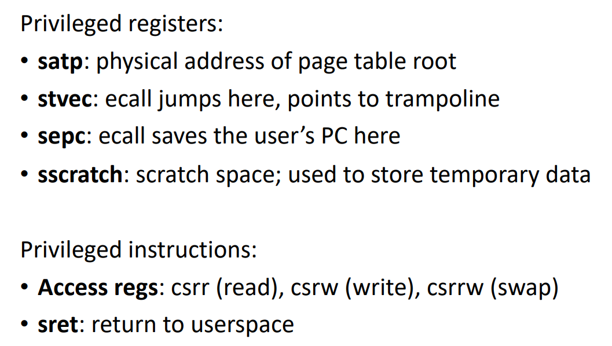

1. 扩展汇编语法 ASM

   1. `asm("assembly code" : outputs : inputs : clobbers);`

   2. outputs: 保存输出的寄存器或内存
      1. `=r` register
      2. `=m` memory
      3. `=rm` register or memory

   3. inputs: 输入内容的寄存器或内存
      1. `r/m/rm`

   4. clobbers: 被重写的寄存器或内存，不需要关心值的那些
      1. 特定寄存器 或者 `memory` `cc`

   5. volatile: 优化指示符

   6. `%0` outputs+inputs中的第0个参数

2. 特权寄存器/指令 - 只能内核访问
   1. 

3. 用户态到内核态转换
   1. 必要步骤
      1. 切换到supervisor模式
      2. 保存PC和寄存器
      3. 切换到内核pagetable和stack
      4. 跳转到内核的C代码
   2. 用户代码不能影响trap过程
   3. trap应当是透明的
   4. `ecall`只做三件事
      1. 切换到supervisor模式
      2. 将PC保存到 `sepc`
      3. 跳转到`stvec`
   5. 必须
      1. 保存寄存器到trapframe
         1. 后续能恢复
         2. 内核从trapframe拿到参数
      2. 恢复内核栈 - 执行内核代码
      3. 恢复内核页表 - 内核代码和数据没有在user的pgtbl上映射
      4. 跳转到usertrap - 处理不同类型的trap
   6. `sscratch` 临时寄存器
   7. `r_scause()` trap的原因