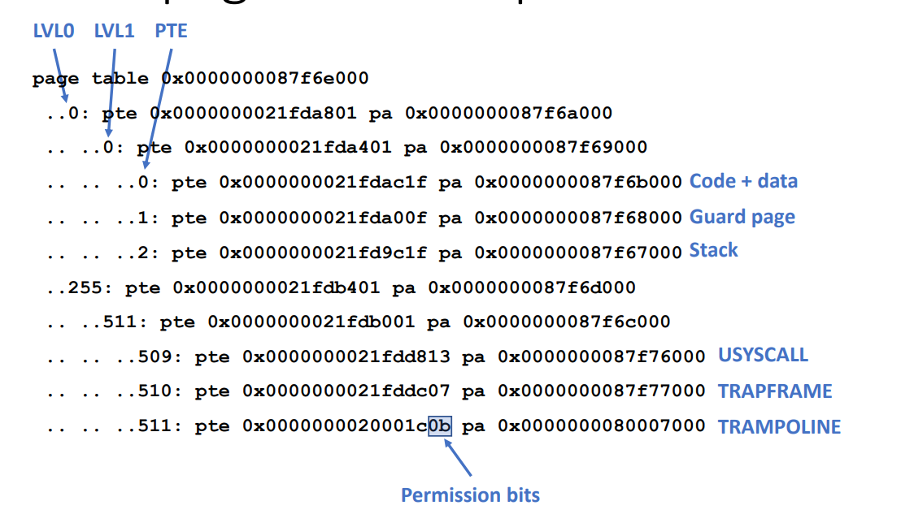

lab pgtbl的实验

1. usyscall：使用类似于trampoline的共享页加速系统调用
   1. Linux包含一个VDSO(Virtual ELF Dynamic Shared Object)系统调用提供了类似功能
   2. 该功能包含`clock_gettime, getcpu, getpid, getppid, gettimeofday, set_tid_address`几个系统调用
2. print pgtbl：下图为print出来的内容的说明

   
3. page access：如何不适用PTE_A标志记录内存page访问
   1. 使用 page fault，请PTE_V清空，如果出现page fault说明被访问
   2. 太慢了...
4. page access案例 - Generational GC
   1. 观测到：许多对象存活时间短
   2. 主要思想：young/old保存在不同区域，对young区域回收更加频繁
   3. 性能影响：避免了对老年代过度追踪
